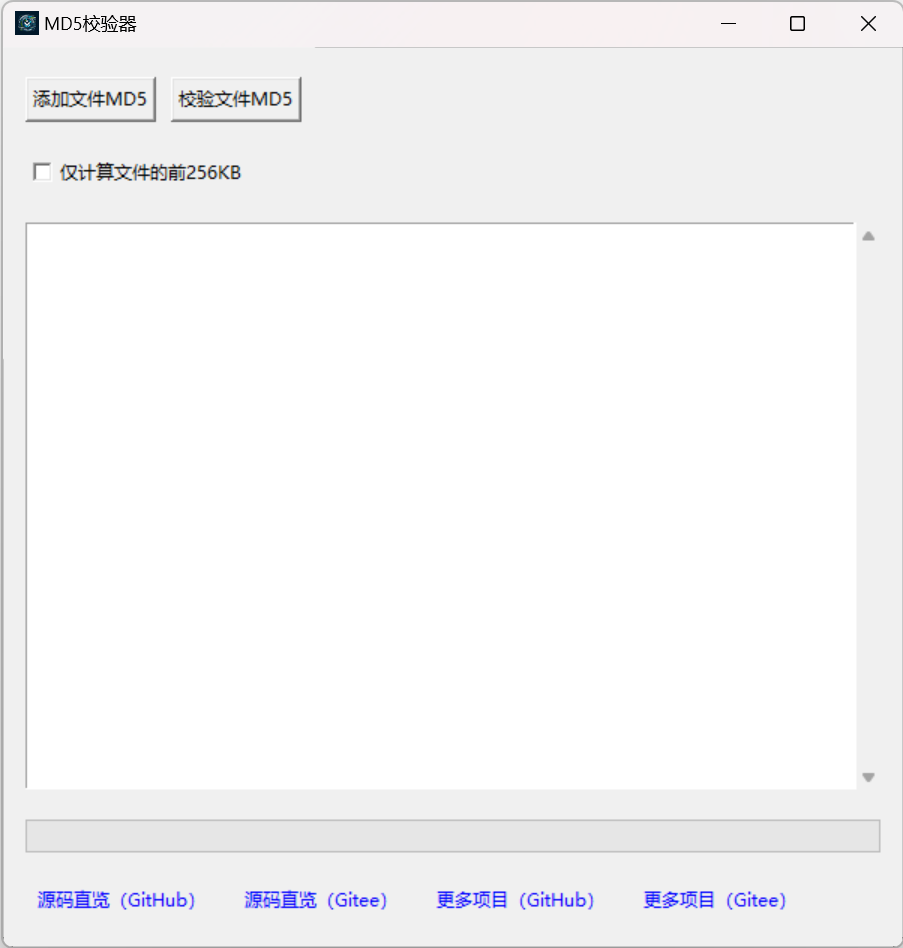

# MD5 校验器

MD5 校验器是一个基于 Python 和 Tkinter 开发的图形用户界面应用程序，用于生成和校验文件的 MD5 哈希值。它允许用户轻松添加文件进行 MD5 哈希生成，并与已存在的哈希值进行比较，以验证文件的完整性。

## 功能特点

- **添加文件MD5**：选择一个或多个文件，计算并显示它们的 MD5 哈希值。
- **校验文件MD5**：选择一个或多个文件，与预先保存的 MD5 哈希值进行比较，以校验文件的完整性。
- **性能优化选项**：提供选项以仅计算文件的前 256KB，以快速生成哈希值。
- **友好的用户界面**：简洁明了的用户界面，方便用户操作和阅读结果。
- **进度指示**：通过进度条显示当前操作的进度。

## 安装指南

在使用 MD5 校验器之前，您需要确保您的系统已安装 Python 和以下依赖包：

- tkinter
- hashlib
- json
- os
- webbrowser

大部分情况下，这些库随 Python 一起安装，无需额外操作。

## 使用说明

1. 启动程序：运行 `md5校验_GUI.py` 启动 MD5 校验器。
2. 添加文件MD5：点击“添加文件MD5”按钮，选择想要计算 MD5 哈希值的文件。
3. 校验文件MD5：点击“校验文件MD5”按钮，选择想要校验的文件。
4. 查看结果：在输出区域查看操作结果。
5. 性能优化：如需仅计算文件的前 256KB，可勾选“仅计算文件的前256KB”选项。

## 开发背景

此应用旨在提供一个简单易用的界面，帮助用户快速校验文件的 MD5 哈希值，以确保文件的完整性和一致性。

## 运行界面展示

## 许可证

此项目采用 [Apache 2.0 许可证](LICENSE)。有关更多信息，请查看 `LICENSE` 文件。

## 联系方式

- GitHub：[https://github.com/Hellohistory/OpenPrepTools]
- Gitee：[https://gitee.com/Hellohistory/OpenPrepTools]

感谢您对 MD5 校验器项目的兴趣！
