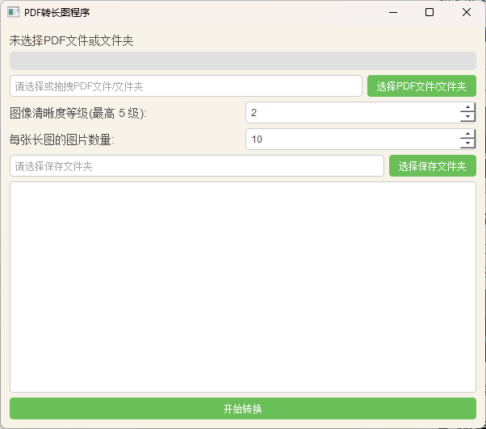

# PDF 转长图

PDF转长图是一个基于 Python 和 PyQT 开发的图形用户界面应用程序。

## 功能特点

1. **批量处理PDF文件和文件夹**：支持选择单个PDF文件、多个PDF文件或包含多个PDF文件的文件夹。可以通过文件对话框选择，或者通过拖拽操作直接将文件或文件夹添加到程序中。

2. **图像缩放比例控制**：用户可以通过界面上的滑块设置图像的缩放比例（1倍到5倍），根据需要调整输出图像的分辨率。

3. **自定义保存路径**：用户可以选择输出文件的保存文件夹，程序会自动将生成的长图保存到指定的路径，并使用PDF文件的名称命名输出文件。

4. **转换进度条**：程序包含一个进度条，用于实时显示批量转换的进度，确保用户了解处理进展。

5. **日志输出功能**：程序集成日志输出框，实时显示PDF处理过程中的消息，记录成功或失败的文件，帮助用户追踪转换过程中的问题。

6. **自动保存和加载设置**：程序自动保存用户的设置（例如上次选择的PDF路径、保存路径、缩放比例等）到`settings.json`文件，下次启动时会自动加载这些设置，简化用户的操作。

7. **多线程处理**：程序采用多线程并行处理PDF文件中的页面，极大提高了转换效率，尤其适用于多页PDF的处理。

8. **拼接多页PDF为长图**：程序支持将PDF的每一页图片提取并按顺序拼接为一张长图。可以处理任意页数的PDF，自动计算拼接后的图像大小并生成最终的图像文件。

9. **异常处理与提示**：程序会在处理过程中捕捉并提示错误，确保用户能够了解哪些文件转换失败，并在转换完成后弹出总结窗口，显示批量处理的结果。

这些功能使得该程序非常适合处理大量PDF文件，将其快速转换为高分辨率的长图，并且具备良好的用户体验和操作简便性。

## 自行打包教程
使用nuitka可能需要安装编译器，这个就请自行google或者百度教程。

1. 安装nuitka库
``
pip install nuitka
``

2. 跳转到PDF2Longimg.py所在目录
``
cd Graph
``

3. 输入下面的命令
``
nuitka --standalone --mingw64 --output-dir=dist --enable-plugin=pyqt5 --windows-console-mode=disable --windows-icon-from-ico=logo_6.ico PDF2Longimg.py
``

## 如果在编译过程中出现以下错误
```angular2html
Traceback (most recent call last):
  File "E:\Code\Github\OpenPrepTools\.venv\lib\site-packages\nuitka\__main__.py", line 206, in <module>
    main()
  File "E:\Code\Github\OpenPrepTools\.venv\lib\site-packages\nuitka\__main__.py", line 188, in main
    MainControl.main()
  File "E:\Code\Github\OpenPrepTools\.venv\lib\site-packages\nuitka\MainControl.py", line 1155, in main
    _main()
  File "E:\Code\Github\OpenPrepTools\.venv\lib\site-packages\nuitka\MainControl.py", line 1004, in _main
    result, scons_options = compileTree()
  File "E:\Code\Github\OpenPrepTools\.venv\lib\site-packages\nuitka\MainControl.py", line 919, in compileTree
    result, scons_options = runSconsBackend()
  File "E:\Code\Github\OpenPrepTools\.venv\lib\site-packages\nuitka\MainControl.py", line 767, in runSconsBackend
    runScons(
  File "E:\Code\Github\OpenPrepTools\.venv\lib\site-packages\nuitka\build\SconsInterface.py", line 403, in runScons
    checkCachingSuccess(source_dir or options["source_dir"])
  File "E:\Code\Github\OpenPrepTools\.venv\lib\site-packages\nuitka\build\SconsCaching.py", line 336, in checkCachingSuccess
    stats = _getCcacheStatistics(ccache_logfile)
  File "E:\Code\Github\OpenPrepTools\.venv\lib\site-packages\nuitka\build\SconsCaching.py", line 282, in _getCcacheStatistics
    for line in getFileContentByLine(ccache_logfile, encoding="utf8"):
  File "E:\Code\Github\OpenPrepTools\.venv\lib\site-packages\nuitka\utils\FileOperations.py", line 793, in getFileContentByLine
    return getFileContents(filename, mode, encoding=encoding).splitlines()
  File "E:\Code\Github\OpenPrepTools\.venv\lib\site-packages\nuitka\utils\FileOperations.py", line 811, in getFileContents
    return f.read()
  File "C:\Users\akaxy\AppData\Local\Programs\Python\Python39\lib\codecs.py", line 701, in read
    return self.reader.read(size)
  File "C:\Users\akaxy\AppData\Local\Programs\Python\Python39\lib\codecs.py", line 504, in read
    newchars, decodedbytes = self.decode(data, self.errors)
UnicodeDecodeError: 'utf-8' codec can't decode byte 0xc1 in position 76800: invalid start byte
Nuitka-Reports: Compilation crash report written to file 'nuitka-crash-report.xml'. Please include it in your bug report.
```
请首先尝试清除缓存，使用命令`ccache -C`，或者更换指令
```angular2html
nuitka --standalone --mingw64 --output-dir=dist --enable-plugin=pyqt5 --windows-console-mode=disable --windows-icon-from-ico=logo_6.ico --disable-ccache PDF2Longimg.py
```

## 运行界面展示



## 许可证

由于本项目采用Qt，受到 GPL 许可证的传染性，本项目的源代码也采用[GPL许可证](LICENSE_2)。

## 项目地址

- GitHub：[https://github.com/Hellohistory/OpenPrepTools/Graph/PDF2Longimg.py]
- Gitee：[https://gitee.com/Hellohistory/OpenPrepTools/Graph/PDF2Longimg.py]
