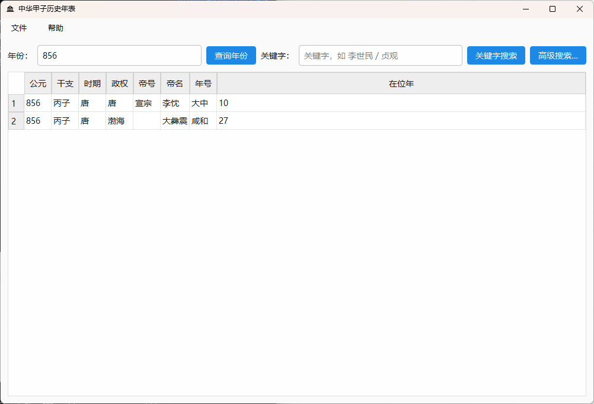
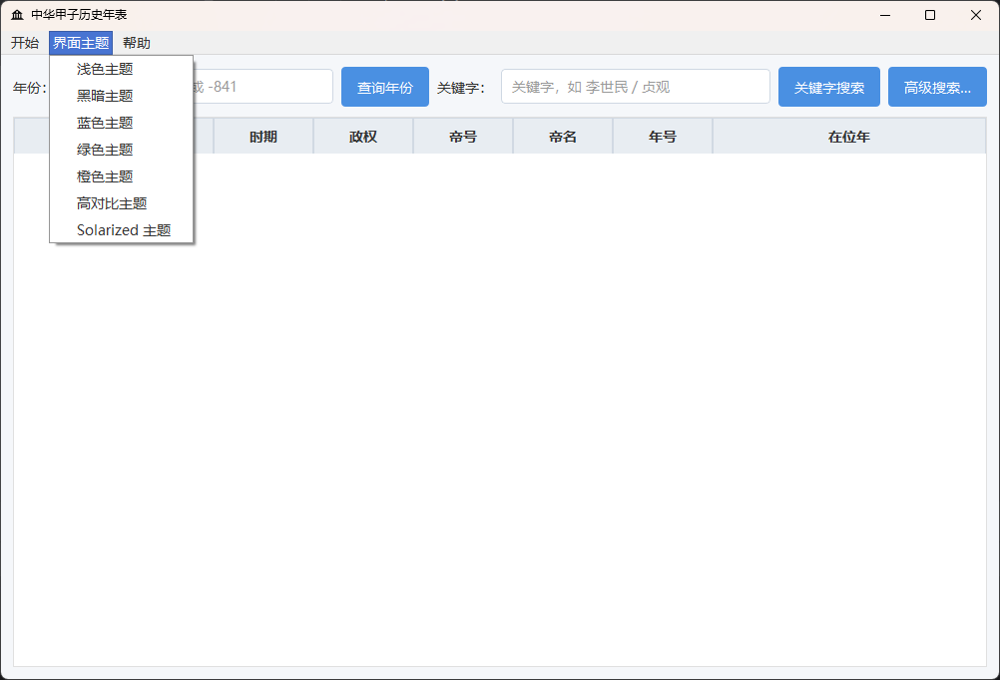

# 中华甲子历史年表项目文档

## 项目概述
中华甲子历史年表是一款详细记录中国从公元前841年至1911年历史纪年信息的工具软件，整合了干支纪年、朝代更迭、帝王年号等丰富历史数据。

## 核心功能

### 📅 完整历史纪年体系
- **时间跨度**：公元前841年（庚申年）至清朝1911年
- **信息维度**：
  - 公元年份
  - 干支纪年（甲子历）
  - 历史时期（朝代）
  - 政权归属
  - 帝王信息（帝号、帝名）
  - 年号纪年

### 🖥️ 用户界面展示
<div align="center">
  
  <p><em>主程序运行界面 - 清晰展示历史纪年信息</em></p>
</div>

### 🎨 个性化主题设置
<div align="center">
  
  <p><em>主题设置界面 - 支持多种视觉风格切换</em></p>
</div>

## 技术实现

**环境要求**：
- Python 3.10
- PySide6 GUI框架
- Nuitka打包工具

### 打包说明
```bash
nuitka --standalone --msvc=latest --output-dir=dist --enable-plugin=pyside6 --include-qt-plugins=platforms,imageformats,styles --windows-console-mode=disable --windows-icon-from-ico=resources/logo.ico app.py
```

**环境要求**：
- Python 3.8-32
- PySide2 GUI框架
- Nuitka打包工具

### 打包说明
```bash
nuitka --standalone --msvc=latest --output-dir=dist --enable-plugin=pyside2 --include-qt-plugins=platforms,imageformats,styles --windows-console-mode=disable --windows-icon-from-ico=resources/logo.ico app.py
```

## 快速下载
[https://xmy521.lanzouy.com/b0j0jtqsh 密码:9jyo](https://xmy521.lanzouy.com/b0j0jtqsh)

## 致谢

特别鸣谢 **耕田四哥** 提供的基础文本资料，使本项目得以实现。

**数据下载**：
[【天翼云盘】中华甲子历史年表-升级版](https://cloud.189.cn/t/EJZZzquuiuAj)  
(访问码: c98g)

## 版本更新

### v1.1 更新内容
1.支持使用简体中文检索
2.新增一些界面主题

### v1.2 更新内容
1.支持使用干支作为关键词检索
2.禁止修改结果表格内容，只允许选中、复制和检索
3.支持样式记忆
4.将Pyside6更换为Pyside2以适配Win7

##### v1.2更新（2025年5月10日）
本次更新无软件更新，数据库数据异常，在显示汉灵帝的年号“建宁”时出现两条异常，一条为从167年开始，一条为从168年开始，经过本人考证，“建宁”年号是从168年开始，因此现已经移除错误内容，
现发布新的数据库文件，可以直接替换resources/History_Chronology.db文件，不必更新整个软件

### v1.3 更新內容（2025年5約17日）
本次软件进行更新，修复了无法使用“东周”、“春秋”、“战国”三个关键词检索的Bug

[20250510更新记录](image/中华甲子历史年表20250510更新.png)
