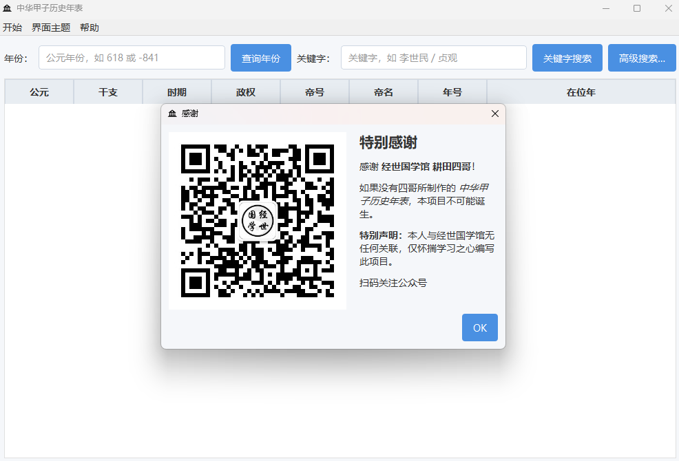

# 中华甲子历史年表项目文档

## 项目概述
中华甲子历史年表是一款详细记录中国从公元前841年至1911年历史纪年信息的工具软件，整合了干支纪年、朝代更迭、帝王年号等丰富历史数据。

## 核心功能

### 📅 完整历史纪年体系
- **时间跨度**：公元前841年（庚申年）至清朝1911年
- **信息维度**：
  - 公元年份
  - 干支纪年（甲子历）
  - 历史时期（朝代）
  - 政权归属
  - 帝王信息（帝号、帝名）
  - 年号纪年

### 🖥️ 用户界面展示
<div align="center">
  
  <p><em>主程序运行界面 - 清晰展示历史纪年信息</em></p>
</div>

### 🎨 个性化主题设置
<div align="center">
  
  <p><em>主题设置界面 - 支持多种视觉风格切换</em></p>
</div>

## 技术实现

### 打包说明
```bash
nuitka --standalone --msvc=latest --output-dir=dist \
       --enable-plugin=pyside6 \
       --include-qt-plugins=platforms,imageformats,styles \
       --windows-console-mode=disable \
       --windows-icon-from-ico=resources/logo.ico app.py
```

**环境要求**：
- Python 3.10
- PySide6 GUI框架
- Nuitka打包工具

## 致谢

特别鸣谢 **耕田四哥** 提供的基础文本资料，使本项目得以实现。

**数据下载**：
[【天翼云盘】中华甲子历史年表-升级版](https://cloud.189.cn/t/EJZZzquuiuAj)  
(访问码: c98g)

## 版本更新

### v1.1 更新内容
- 🔍 **检索功能增强**
  - 支持繁体/简体中文混合检索
- 🎨 **界面美化**
  - 新增多套主题配色方案
  - 优化视觉呈现效果

---

<div align="center">
  
  <p><em>项目感谢界面</em></p>
</div>