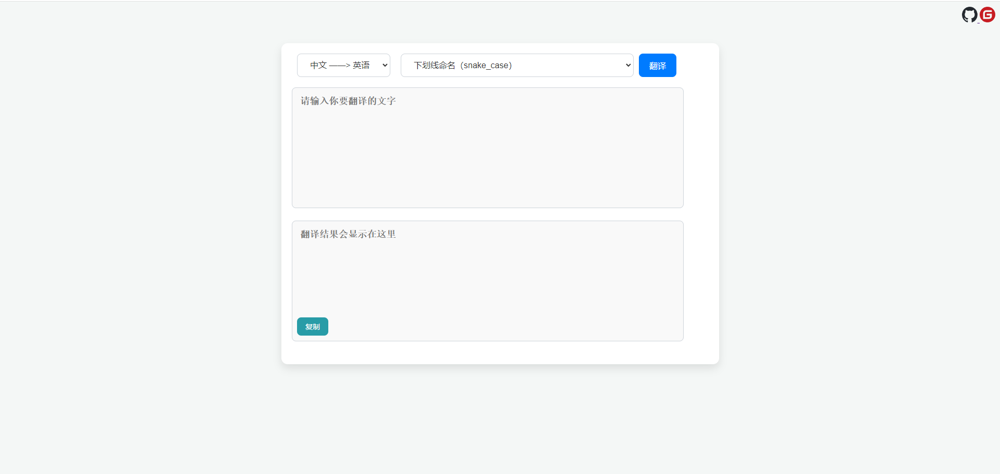

# 开发者工具

这是一个命名翻译工具，旨在帮助英语非母语开发人员将中文变量名、函数名等翻译成英文，或者将英文翻译成中文。
本工具支持多种翻译源，并支持多种常见命名规范，如大驼峰、小驼峰、常量命名等。

## 功能特性

- 支持多种命名规范，如`snake_case`, `camelCase`, `PascalCase`, `CONSTANT_CASE`等。
- 支持双语之间的双向翻译。
- 支持多个翻译源，包括百度翻译（官方版、第三方版）和有道翻译（第三方版）。
- 可通过配置文件切换。

## 页面展示



## 配置

在运行工具之前，您需要在配置文件 `config.yaml` 中填写翻译源的API密钥和其他配置。

示例 `config.yaml`：

```yaml
# config.yaml

# 百度翻译官方API配置
baidu:
  appid: ""
  secret_key: ""

# 翻译源设置
# 可选值：baidu_official(百度官方API), baidu_free(百度第三方), youdao_free(有道第三方)
default_translation_source: "baidu_free"
```

## 使用方法

运行工具以后访问：
   ```angular2html
   http://127.0.0.1:36920/static/index.html
   ```

## 开发依赖安装

1. 克隆项目代码：

    ```bash
    git clone https://github.com/Hellohistory/CodeTranslation.git
    ```
   或者是：
    ```bash
    git clone https://gitee.com/Hellohistory/CodeTranslation.git
    ```

2. 安装依赖：

    ```bash
    pip install -r requirements.txt
    ```


