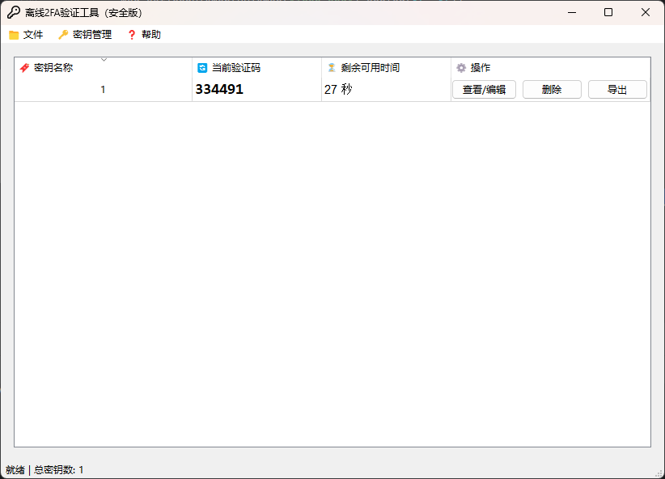

#### 本工具是一个基于 PySide6 的桌面应用程序，专门用于生成2FA验证码  
  
#### 有时候我们会需要使用到基于时间的2FA验证码，通常情况下是使用谷歌，电脑上也有基于网页版的工具，但是我不太放心使用，因此这个基于Python的小工具就诞生了！
## 界面展示  

  

## 源代码与二次开发  

如你有兴趣对本工具进行二次开发，请先阅读 LICENSE 文件，遵守相关协议。本项目的核心逻辑位于 `totp_hotp_core.py` 文件中，已进行封装，二次开发时请重点关注此部分。 

## 自行编译教程

本项目采用`nuitka`进行打包，打包指令如下：

```angular2html
nuitka --standalone --mingw64 --output-dir=dist --enable-plugin=pyside6 --windows-console-mode=disable --windows-icon-from-ico=icon.ico 2fa_tool_gui.py
```

## 项目链接  

- [GitHub 地址：https://github.com/Hellohistory/OpenPrepTools](https://github.com/Hellohistory/OpenPrepTools)  
- [Gitee 地址：https://gitee.com/Hellohistory/OpenPrepTools](https://gitee.com/Hellohistory/OpenPrepTools)  

## [技术原理说明：TOTP 算法与实现解析](TechnicalPrinciples/TOTP%20算法与实现解析.md)

## [技术原理说明：HOTP 算法与实现解析](TechnicalPrinciples/HOTP%20算法与实现解析.md)

## 更新日志
### 1.1 0010_20250426.zip
1.更新GUI，修复异常GUI显示
2.GUI从PyQt5修改为PySide6
3.补全requirements.txt
#### 下载地址
[蓝奏云：https://xmy521.lanzn.com/idyJf2uih42j](https://xmy521.lanzn.com/idyJf2uih42j)

### 1.2 
1.更新并支持HOTP算法
#### 下载地址
[蓝奏云：https://xmy521.lanzn.com/iqCCY2uor3ah](https://xmy521.lanzn.com/iqCCY2uor3ah)
[百度网盘：https://pan.baidu.com/s/1zjPaeLrN2mvRLHvY2NA6nQ?pwd=8pvq](https://pan.baidu.com/s/1zjPaeLrN2mvRLHvY2NA6nQ?pwd=8pvq)

## 最后说明  

此密码无法恢复，无法找回，请务必牢记！！！！！！

## 最新版本下载地址

[百度网盘：https://pan.baidu.com/s/1zjPaeLrN2mvRLHvY2NA6nQ?pwd=8pvq](https://pan.baidu.com/s/1zjPaeLrN2mvRLHvY2NA6nQ?pwd=8pvq)

[蓝奏云：https://xmy521.lanzn.com/iqCCY2uor3ah](https://xmy521.lanzn.com/iqCCY2uor3ah)
