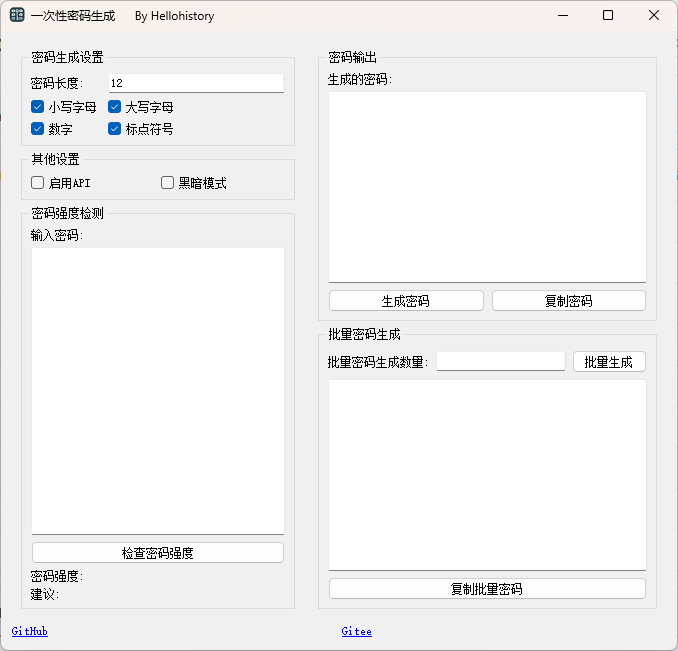

# 一次性密码生成与检测工具

一次性密码生成与检测工具是一个基于 Python 和 PyQT 开发的图形用户界面应用程序，支持检测密码强度。

## 功能特点

- **支持程序运行API接口**：程序界面开启API接口功能可以在外部调用，下面是示例代码
```python
import requests


def generate_password(api_url, length, lowercase, uppercase, digits, punctuation):
    payload = {
        "length": length,
        "lowercase": lowercase,
        "uppercase": uppercase,
        "digits": digits,
        "punctuation": punctuation
    }
    response = requests.post(api_url, json=payload)

    if response.status_code == 200:
        return response.json().get("password")
    else:
        return f"Error: {response.status_code}, {response.text}"


if __name__ == "__main__":
    api_url = "http://localhost:25698/generate-password/"
    length = 12
    lowercase = True
    uppercase = True
    digits = True
    punctuation = True

    password = generate_password(api_url, length, lowercase, uppercase, digits, punctuation)
    print(f"Generated Password: {password}")

```
- **检测密码强度**：密码强度分为四等，支持用户自行输入密码，也支持单次生成密码以后自行检测强度
- **彻底离线与开源**：程序拒绝提供任何关于密码的储存与恢复，适用于高密级的密码生成。

## 自行打包教程
使用nuitka可能需要安装编译器，这个就请自行google或者百度教程。
1. 安装nuitka库
``
pip install nuitka
``
2. 输入下面的命令
``
nuitka --standalone --mingw64 --output-dir=dist --enable-plugin=pyqt5 --windows-disable-console --windows-icon-from-ico=logo_5.ico code.py
``

## 运行界面展示



## 许可证

由于本项目采用Qt，受到 GPL 许可证的传染性，本项目的源代码也采用 GPL 许可证。

## 项目地址

- GitHub：[https://github.com/Hellohistory/OpenPrepTools/Other/Safe_Code]
- Gitee：[https://gitee.com/Hellohistory/OpenPrepTools/Other/Safe_Code]
