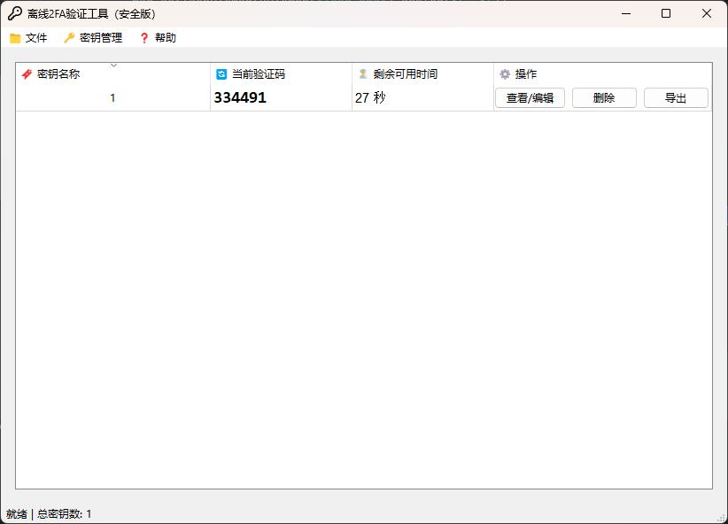

#### 本工具是一个基于 PyQt5 的桌面应用程序，专门用于生成2FA验证码  
  
#### 有时候我们会需要使用到基于时间的2FA验证码，通常情况下是使用谷歌，电脑上也有基于网页版的工具，但是我不太放心使用，因此这个基于Python的小工具就诞生了！
## 界面展示  

  

## 源代码与二次开发  

如你有兴趣对本工具进行二次开发，请先阅读 LICENSE 文件，遵守相关协议。本项目的核心逻辑位于 `totp_core.py` 文件中，已进行封装，二次开发时请重点关注此部分。 

## 自行编译教程

1. 安装所需要的依赖包，使用 pip 进行安装。

```angular2html
pip install requests PyQt5 hashlib pycryptodome nuitka
```
2. 编译项目

本项目采用`nuitka`进行打包，打包指令如下：

```angular2html
nuitka --standalone --mingw64 --output-dir=dist --enable-plugin=pyqt5 --windows-console-mode=disable  totp_gui.py
```

## 项目链接  

- [GitHub 地址](https://github.com/Hellohistory/OpenPrepTools)  
- [Gitee 地址](https://gitee.com/Hellohistory/OpenPrepTools)  
  
## 最后说明  

储存使用的只是非常简单的JSON储存，没有进行加密处理，因此在使用的时候需要自己进行加密处理，以免被他人窃取。

## 下载地址

[百度网盘](https://pan.baidu.com/s/1_3Pps3YbQb3c0faXxTTY4w?pwd=xkdb)

[蓝奏云](https://xmy521.lanzn.com/iQi2r2g0854b)
