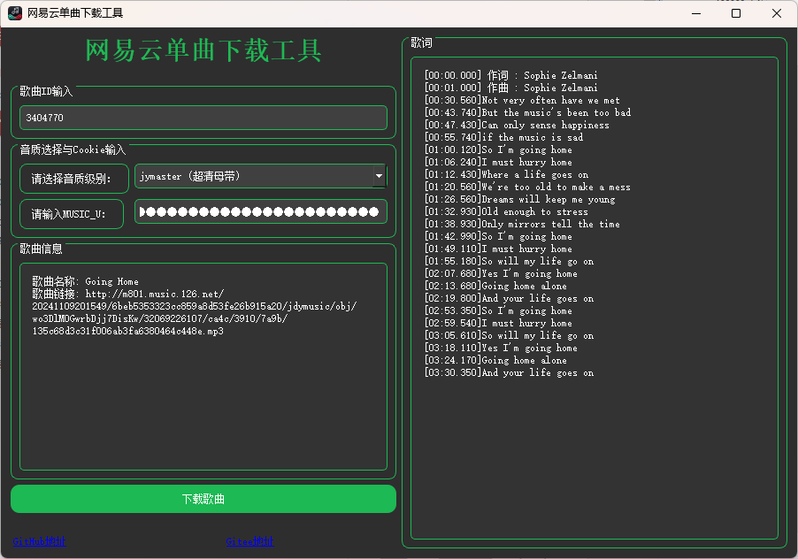
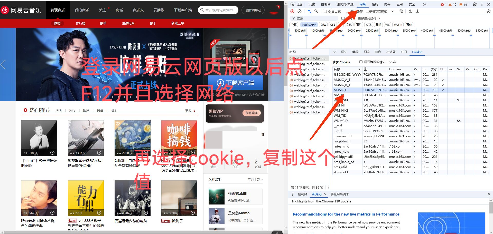

#### 本工具是一个基于 PyQt5 的桌面应用程序，专门用于下载网易云音乐的单曲。你只需输入网易云音乐的歌曲 ID，选择所需音质，并提供 MUSIC_U cookie，即可轻松下载心仪的歌曲。  
  
#### 本工具参考并改编自 [Suxiaoqinx 的项目](https://github.com/Suxiaoqinx/Netease_url/tree/main)，在此表示诚挚感谢。  
## 界面展示  

  
  
## 使用说明  

1. **获取 MUSIC_U Cookie**：请先登录网页版的网易云音乐，从浏览器中获取你的 MUSIC_U Cookie。  
2. 
3. **输入信息**：在软件中输入获取到的 MUSIC_U Cookie，选择你想要的音质级别（一定要先选择音质）。  
4. **下载歌曲**：输入网易云音乐的歌曲 ID，点击下载按钮，歌曲将会保存到 `download` 文件夹中。  
  
## 注意事项  

- 确保提供有效的 MUSIC_U Cookie，否则可能无法成功下载特定音质的歌曲。  
- 下载的歌曲将自动保存到 `download` 文件夹中。  
- 本项目仅供学习与交流，请勿将其用于任何商业用途。  
  
## 源代码与二次开发  

如你有兴趣对本工具进行二次开发，请先阅读 LICENSE 文件，遵守相关协议。本项目的核心逻辑位于 `netease_music_core.py` 文件中，已进行封装，二次开发时请重点关注此部分。 

## 自行编译教程

1. 安装所需要的依赖包，使用 pip 进行安装。

```angular2html
pip install requests PyQt5 hashlib cryptography nuitka
```
2. 编译项目

本项目采用`nuitka`进行打包，打包指令如下：

```angular2html
nuitka --standalone --mingw64 --output-dir=dist --enable-plugin=pyqt5 --windows-console-mode=disable --windows-icon-from-ico=163.ico unetease_music_ui.py
```
  
## docker 教程

本项目已经完成对于核心代码的封装工作，对于`docker`有经验的朋友可以自行打包

相关信息在[docker相关代码](../Other/163_music_download/163_music_download_docker)

## 致谢  

特别感谢 [Suxiaoqinx](https://github.com/Suxiaoqinx/Netease_url/tree/main) 提供的项目支持，为本工具的开发奠定了基础。  
  
## 项目链接  

- [GitHub 地址](https://github.com/Hellohistory/OpenPrepTools)  
- [Gitee 地址](https://gitee.com/Hellohistory/OpenPrepTools)  
  
## 最后说明  

本工具目前只支持单曲下载功能，不会提供批量下载的支持。如你有更高的需求，可以自行修改代码进行扩展。

## 下载地址

[百度网盘]( https://pan.baidu.com/s/1oZd5_Kb6m6padtIobZS0qw?pwd=at7f)

[蓝奏云](https://xmy521.lanzn.com/iWov02enq0ta)


